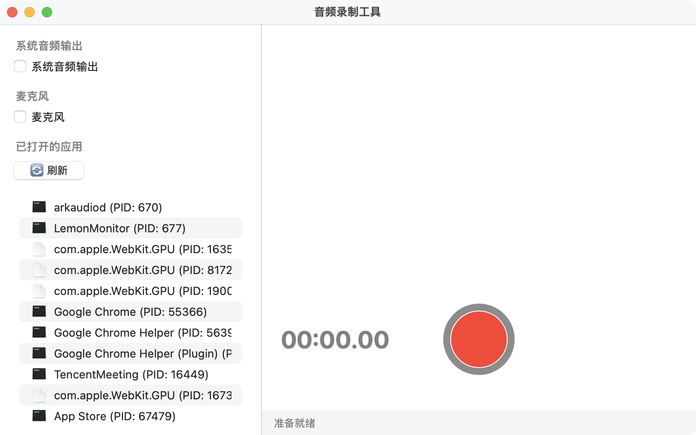

# AudioRecordMac

一个功能强大的 macOS 音频录制应用程序，支持麦克风录制和系统音频录制两种模式，基于 Swift 和 AppKit 开发。

## ✨ 主要功能

- 🎤 **麦克风录制** - 录制外部音频输入
- 🔊 **系统音频录制** - 录制应用程序音频输出（支持指定进程）
- 📊 **实时电平显示** - 专业的音频电平监控界面
- 🎵 **多种音频格式** - 支持 WAV (PCM) 和 M4A (AAC) 格式
- 🔧 **高质量音频** - 44.1kHz / 32-bit Float 高精度录制
- 🎯 **进程选择** - 可录制特定应用程序的音频输出

## 🖼️ 应用界面



## 🚀 快速开始

### 系统要求
- macOS 14.4+ (Process Tap 功能)
- macOS 12.3+ (ScreenCaptureKit 功能)
- 适当的系统权限（麦克风/屏幕录制）

### 安装与运行
```bash
git clone <repository-url>
cd audio_record_mac
./build.sh
open build/AudioRecordMac.app
```

## 📱 使用指南

### 麦克风录制
1. 选择"麦克风"模式
2. 授予麦克风权限
3. 点击"开始录制"按钮
4. 实时查看电平显示

### 系统音频录制
1. 选择"系统音频"模式
2. 授予屏幕录制权限
3. 可选择特定应用程序进行录制
4. 点击"开始录制"按钮

## 🏗️ 技术架构

### 核心框架

#### AVFoundation
- **用途**: 音频应用基础框架
- **功能**: 音频录制、播放、格式转换、权限管理
- **关键组件**: `AVAudioEngine`、`AVAudioFile`、`AVAudioMixerNode`

#### CoreAudio Process Tap (macOS 14.4+)
- **用途**: 系统音频录制
- **功能**: 捕获特定进程或系统混音音频
- **关键组件**: `CATapDescription`、`AudioHardwareCreateProcessTap`

#### Accelerate
- **用途**: 高性能音频信号处理
- **功能**: RMS 电平计算、实时音频分析
- **关键组件**: vDSP 函数库

### 录制模式详解

#### 1. 麦克风录制 (AVAudioEngine)
```swift
// 核心架构
inputNode -> recordMixer -> mainMixerNode
```

**关键参数:**
- 采样率: 48kHz
- 声道数: 2 (立体声)
- 缓冲大小: 4096 帧
- 格式: PCM Float32

**注意事项:**
- 需要麦克风权限
- 首次切换时主动请求权限
- 使用 `format: nil` 避免格式不匹配

#### 2. 系统音频录制 (CoreAudio Process Tap)
```swift
// 录制流程
Process Tap -> Aggregate Device -> Audio Callback -> File
```

**关键参数:**
- 采样率: 44.1kHz (CD 标准)
- 位深: 32-bit Float (高精度)
- 声道数: 2 (立体声)
- 格式: Linear PCM Float

**支持功能:**
- 单进程录制
- 多进程混音录制
- 系统全局混音录制

### 音频格式配置

#### WAV (PCM) 格式
```swift
AudioStreamBasicDescription(
    mSampleRate: 44100.0,
    mFormatID: kAudioFormatLinearPCM,
    mFormatFlags: kAudioFormatFlagIsFloat | kAudioFormatFlagIsPacked,
    mBitsPerChannel: 32,
    mChannelsPerFrame: 2
)
```

#### M4A (AAC) 格式
```swift
[
    AVFormatIDKey: kAudioFormatMPEG4AAC,
    AVSampleRateKey: 48000,
    AVNumberOfChannelsKey: 2,
    AVEncoderAudioQualityKey: AVAudioQuality.high.rawValue
]
```

## 🔧 核心类结构

### 主要组件
- `AppDelegate` - 应用程序生命周期管理
- `MainViewController` - 主视图控制器
- `AudioRecorderController` - 音频录制控制器（工厂模式）
- `CoreAudioProcessTapRecorder` - 系统音频录制器
- `MicrophoneRecorder` - 麦克风录制器
- `LevelMeterView` - 专业电平表视图
- `ProcessTapManager` - Process Tap 管理器
- `AudioToolboxFileManager` - 音频文件管理器

### 工具类
- `AudioUtils` - 音频工具类（格式转换、电平计算）
- `FileManagerUtils` - 文件管理工具
- `Logger` - 统一日志记录器
- `PermissionManager` - 权限管理

## 📊 电平监控

### 实时电平计算
```swift
// RMS 电平计算
let rms = sqrt(sum(sample * sample) / frameCount)
let normalizedLevel = min(1.0, rms * sensitivityMultiplier)
```

### 电平表特性
- **录制模式**: 红色渐变，实时响应
- **播放模式**: 蓝色渐变，高灵敏度
- **专业显示**: 支持峰值保持、噪声门控制
- **锯齿效果**: 模拟专业音频设备的视觉效果

## 📁 文件管理

### 默认保存位置
```
~/Documents/AudioRecordings/
```

### 文件命名规则
- 麦克风录制: `microphone_YYYY-MM-DD_HH-mm-ss.wav`
- 系统音频: `system_AppName_YYYY-MM-DD_HH-mm-ss.wav`

### 支持的格式
- **WAV (PCM)**: 无损质量，适合后期处理
- **M4A (AAC)**: 硬件加速，文件体积小

## 🔐 权限管理

### 麦克风权限
- 首次切换到麦克风模式时请求
- 录制前进行静默检查

### 屏幕录制权限
- 首次切换到系统音频模式时请求
- 录制前进行异步检查并引导设置

## 🎛️ 高级功能

### 进程选择
- 自动检测运行中的音频应用程序
- 支持指定单个或多个进程录制
- 实时进程列表更新

### 音频处理
- 实时电平监控
- 格式自动适配
- 高质量音频保持

### 扩展性
- 模块化设计，易于添加新功能
- 支持自定义音频处理链
- 可扩展的格式支持

## 🐛 故障排除

### 常见问题

**Q: 录制没有声音？**
A: 检查权限设置，确保已授予麦克风或屏幕录制权限。

**Q: 系统音频录制失败？**
A: 确保系统版本为 macOS 14.4+，并检查目标应用程序是否正在播放音频。

**Q: 音频文件音调异常？**
A: 应用使用 44.1kHz 采样率，确保播放器支持该采样率。

### 调试信息
应用提供详细的日志输出，可通过控制台查看录制过程的详细信息。

## 📄 许可证

本项目采用 MIT 许可证。详见 [LICENSE](LICENSE) 文件。

## 🤝 贡献

欢迎提交 Issue 和 Pull Request 来改进这个项目。

## 📞 联系方式

如有问题或建议，请通过以下方式联系：
- 提交 GitHub Issue
- 发送邮件至 [your-email@example.com]

---

**注意**: 本应用需要适当的系统权限才能正常工作。请在使用前仔细阅读权限说明。