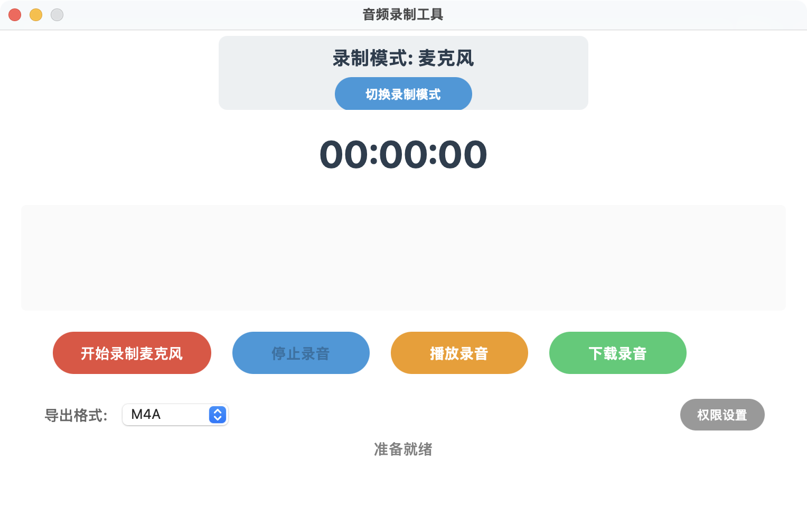

# AudioRecordMac - macOS 音频录制工具

一个基于 Swift 和 AppKit 开发的 macOS 音频录制应用程序，支持「麦克风」与「系统声音」两种录制模式。

## 应用界面截图



将截图文件保存为 `assets/screenshot-main.png`（相对项目根目录），README 将自动显示。

## 核心系统 API

### 1. 核心框架介绍

#### AVFoundation
- **作用**: 音频应用的基础框架，负责所有音频相关的系统操作
- **功能**: 音频录制、播放、格式转换、权限管理
- **关键组件**: AVAudioEngine、AVAudioFile、AVAudioMixerNode

#### Accelerate
- **作用**: 性能优化的数学计算框架，专门用于实时音频分析
- **功能**: 高性能数学运算、信号处理、音频电平计算
- **关键组件**: vDSP 函数库，用于 RMS 计算和音频分析

### 2. 音频录制 API

#### AVAudioEngine
- 用途: 麦克风录制/播放链路核心
- 主要组件:
  - `AVAudioEngine.inputNode`: 麦克风输入节点
  - `AVAudioMixerNode`: 混音节点（安装 tap 抓取 PCM）
  - `AVAudioPlayerNode`: 播放节点（用于回放）

#### AVAudioFile
- 用途: 音频文件写入/读取
- 支持格式: M4A(AAC), WAV(PCM)（当前不支持 MP3 实时编码）
- 常用参数:
```swift
// M4A (AAC) 建议参数
AVFormatIDKey: kAudioFormatMPEG4AAC
AVSampleRateKey: 48000
AVNumberOfChannelsKey: 2
AVEncoderAudioQualityKey: AVAudioQuality.high.rawValue

// WAV (PCM) 建议参数
AVFormatIDKey: kAudioFormatLinearPCM
AVSampleRateKey: 48000
AVNumberOfChannelsKey: 2
AVLinearPCMBitDepthKey: 16
AVLinearPCMIsFloatKey: false
AVLinearPCMIsBigEndianKey: false
```

#### ScreenCaptureKit (系统声音录制)
- 用途: 录制系统输出音频（macOS 12.3+）
- 主要组件:
  - `SCStream`、`SCContentFilter`、`SCStreamConfiguration`、`SCStreamOutput`

### 3. 播放与电平
- 播放使用 `AVAudioEngine + AVAudioPlayerNode`；在 `mainMixerNode` 安装 tap 获取 `AVAudioPCMBuffer`，计算 RMS 电平并回调到 UI。
```swift
playbackEngine.mainMixerNode.installTap(onBus: 0, bufferSize: 4096, format: nil) { buffer, _ in
    let level = calculateRMSLevel(from: buffer)
    onLevel?(level)
}
```

### 4. 电平计算（RMS）
```swift
let rms = sqrt(sum(sample*sample) / frameCount)
let level = min(1.0, rms * 20.0)
```

## 两种录制模式（关键代码 / 参数 / 注意事项）

### A. 麦克风录制（AVAudioEngine）
- 关键代码：`MicrophoneRecorder`
  - 构图：`inputNode -> recordMixer -> mainMixerNode`
  - 顺序：配置 -> 启动引擎 -> 安装 tap（避免未启动 tap 无数据）
  - 写入：`AVAudioFile`（默认 M4A/AAC，48kHz，立体声）
  - Tap：`recordMixer.installTap(onBus: 0, bufferSize: 4096, format: nil)`（用节点当前格式，降低格式不匹配风险）
- 关键参数：
  - 采样率 `48000`、声道 `2`、缓冲 `4096` 帧、`pcmFormatFloat32`
  - `engine.mainMixerNode.outputVolume = 0` 避免监控时本地回放
- 注意事项：
  - 需要麦克风权限；首次在“切换到麦克风模式”时请求
  - 文件与缓冲格式不一致会导致静音；采用 `format: nil` 让系统匹配

### B. 系统声音录制（ScreenCaptureKit）
- 关键代码：`SystemAudioRecorder`
  - 获取内容：`SCShareableContent.excludingDesktopWindows(_, onScreenWindowsOnly: true)`
  - 过滤器：`SCContentFilter(display: display, excludingApplications: [本应用])`
  - 配置：
```swift
let config = SCStreamConfiguration()
config.capturesAudio = true
config.excludesCurrentProcessAudio = true // 包含本应用声音设为 false
config.sampleRate = 48000
config.channelCount = 2
// 视频最小分辨率以驱动音频时钟
config.width = 320; config.height = 240
config.minimumFrameInterval = CMTime(value: 1, timescale: 60)
config.queueDepth = 5
```
  - 输出：同时添加 `.audio` 与 `.screen` 输出（视频最小处理）
  - 写入：将 `CMSampleBuffer` 拷贝到 `AVAudioPCMBuffer` 再写入 `AVAudioFile`
- 注意事项：
  - 需要“屏幕录制”权限；macOS 12.3+ 才支持 ScreenCaptureKit
  - 添加屏幕输出以驱动音频；`excludesCurrentProcessAudio` 控制是否录到本应用声音
  - DRM/受保护内容可能被系统静音

## 播放控制
- 支持随时“停止播放”；播放状态下按钮文案变更为“停止播放”。
- 电平为播放样式（蓝色）并提高灵敏度，视觉更动态。

## 权限要求与时机
- 麦克风权限：在“切换到麦克风模式”时主动请求；录制时仅静默检查并引导。
- 屏幕录制权限：在“切换到系统音频模式”时主动请求；录制前进行异步静默检查并引导设置。

## 文件输出
- 默认保存位置：`~/Documents/AudioRecordings/`
- 文件命名：`录音_YYYY-MM-DD_HH-mm-ss.m4a`（或 `.wav`）

## 主要类结构
- `AppDelegate`: 应用程序生命周期管理
- `MainViewController`: 主视图控制器
- `AudioRecorderController`: 音频录制控制器（工厂，切换模式）
- `MainWindowView`: 主窗口视图
- `LevelMeterView`: 电平表视图（录制=红色，播放=蓝色）
- `LevelMonitor`: 电平监控器
- `AudioUtils`: 音频工具类
- `FileManagerUtils`: 文件管理工具
- `Logger`: 日志记录器

## 设计模式
- 委托模式：视图与控制器通信
- 观察者模式：状态变化通知
- 单例模式：工具类实例管理

## 可选参数与可扩展功能
- ScreenCaptureKit：
  - `excludesCurrentProcessAudio` 切换是否录到本应用声音
  - `captureMicrophone = true`（**仅用于屏幕录制时叠加麦克风解说**，不适合纯麦克风录制）
  - `width/height/minimumFrameInterval/queueDepth` 影响性能与延迟
  - macOS 15+ 可用 `SCRecordingOutput` 直接封装为 MP4（参考 Apple Sample）
- AVAudioEngine：
  - 在 `recordMixer` 上做音量、EQ、压缩、混响等实时处理
  - 同时录制系统声音与麦克风：混合到同一文件或分别落盘
- 文件格式：
  - M4A（AAC）硬件加速、体积小；WAV（PCM）无损、适合后期处理
- 后期处理：
  - 响度归一、降噪、压缩；或导出 WAV 后离线转码为 MP3（LAME/FFmpeg）
